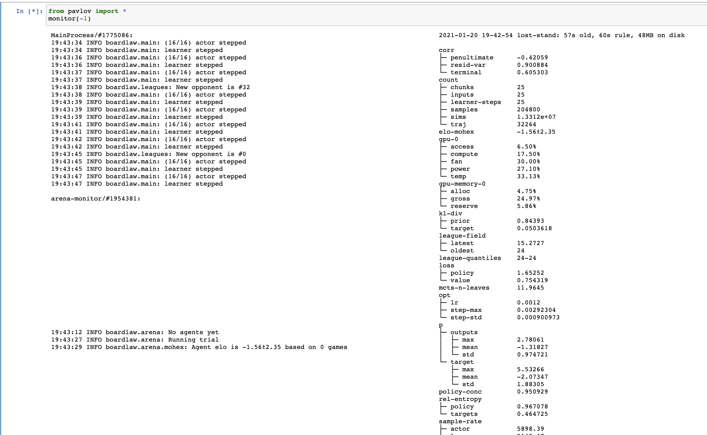
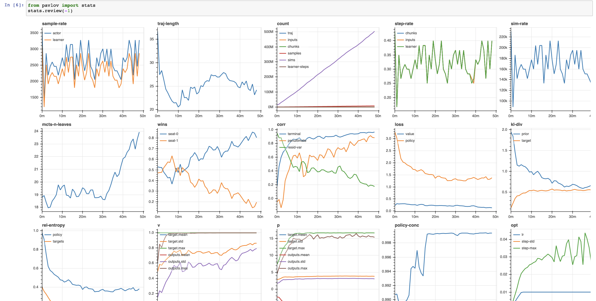

###############
Developer Guide
###############

So far boardlaw's a `one-man project <https://andyljones.com>`_, but I'm keen to change that. If you think it's an
interesting research direction and you'd like to help out, drop by the `RL <https://discord.gg/xhfNqQv>`_ or `EAI
<https://discord.gg/K8xcydxcka>`_ Discords and give **@andyljones** ping! I'm usually active London daytime. Slightly 
more formally, you can post an issue on the tracker, or `give me an email <me@andyljones.com>`_.

Open Issues
-----------
There's a list of issues `on the tracker <https://github.com/andyljones/boardlaw/issues>`_. These are all pretty 
high-level, but they're not exhaustive - if there's a new direction you'd like to take things in, I'm very much 
open to suggestions.

One thing I'd advise against though is putting together a PR without chatting to me first: this is a research repo and 
large chunks of it can change dramatically and unexpectedly. I don't want to have to tell anyone that their work depends
recently-obsolete code.

Workflow
--------
Below is a step-by-step guide to replicating my workflow. Since I'm very keen on my workflow 
working, copying it exactly is the best way to get a workflow that works yourself. If you want to adapt your *own* 
workflow to boardlaw, these same steps should contain all the miscellaneous information you need.
 
Prelude
*******
My workflow uses vscode for editing, Jupyter for interaction, and Docker for reproducibility, and it all sits on a remote
GPU-equipped server. To replicate my that, you'll need 

* a server with a GPU that `has compute capability 7.5 or above <https://en.wikipedia.org/wiki/CUDA#GPUs_supported>`_ 
  and at least ~6GB of memory
* NVIDIA drivers 460.32.03 or above
* both Docker and the `NVIDIA container toolkit <https://docs.nvidia.com/datacenter/cloud-native/container-toolkit/install-guide.html#docker>`_

To test that you've got all of this right, you should be able to run

.. code::

    docker run pytorch/pytorch:1.7.0-cuda11.0-cudnn8-devel python -c "import torch; print(torch.tensor(1).cuda())"

This is the most basic exercise of PyTorch and CUDA possible, and it should print out ``torch.tensor(1)``.

Setup
*****
First, clone the repo into a local dir.

.. code::

    git clone git@github.com:andyljones/boardlaw.git

Then pull and run the :github:`boardlaw image <docker>`. Run this command, substituting the dir you just cloned the 
repo into as $CODE_DIR. In my case, that's ``/home/ajones/code/boardlaw``.

.. code::

    docker pull andyljones/boardlaw
    docker run --name boardlaw --shm-size="16g" -v CODE_DIR:/code andyljones/boardlaw:latest

For completeness, the switches are

* ``--name boardlaw``, so you can refer to the container as ``boardlaw`` in docker commands rather than whatever random
  phrase docker comes up with.
* ``--shm-size``, to up the shared memory size. The default 64MB can upset PyTorch's IPC.
* ``-v``, to mount the dir you cloned the repo into as ``/code`` inside the Docker container.

The above is the short version of the command, which will keep the container in the foreground of your terminal 
session so you can easily see if anything goes wrong. Typically I run the container with the much longer command

.. code::

    docker run -d \
        --name boardlaw \ 
        --shm-size="16g" \
        -v CODE_DIR:/code \
        -p 35022:22 \ 
        --cap-add SYS_ADMIN \
        --cap-add=SYS_PTRACE \
        --security-opt apparmor=unconfined \
        --security-opt seccomp=unconfined \
        andyljones/boardlaw:latest

which additionally has

* ``-d`` to detach it and run it in the background. You can get the logs with ``docker logs boardlaw`` if you need to.
* ``-p 35022:22`` to open port 22 so that ``nsys-systems`` profiler can attach remotely
* ``--cap-add``, ``--security-opt`` so that various debugging tools like ``compute-sanitizer`` work properly.

But don't worry about the long command for now; just use the short one.

Once the container is running, you can check its status with ``docker container ls``, and you can open up a terminal 
in it with ``docker exec -it boardlaw /bin/bash``. 

To check everything's working, use 

.. code::

    docker exec -it boardlaw python -c "import torch; print(torch.tensor(1).cuda())" 

to test PyTorch generally, and 

.. code::

    docker exec -it boardlaw python -c "from boardlaw import *" 

to test that boardlaw can be imported.

Editor
******
At this point you've got a copy of the boardlaw container up and running, all we've gotta do now is hook the dev tools up!

Personally, I use `vscode <https://code.visualstudio.com/>`_ and its superb `remote support 
<https://code.visualstudio.com/docs/remote/remote-overview>`_. You can open up a vscode instance and manually connect to
the container using the ``Remote Container: Attach to Running Container`` command, but what's easier is `this bit of 
magic <https://github.com/microsoft/vscode-remote-release/issues/2133#issuecomment-618328138>`_:

.. code::

    DOCKER_HOST=ssh://SERVER_HOSTNAME
    uri=$(python -c "import json; desc = json.dumps({'containerName': '/boardlaw', 'settings': {'host':'$DOCKER_HOST'}}); print(f'vscode-remote://attached-container+{desc.encode().hex()}/code')")
    code --folder-uri "$uri"

Either way, you'll end up with a vscode instance running directly in the container, and from here you should be able to 
edit files and run code from the built-in terminal.

Jupyter
*******
Finally, if you go to the 'Remote Explorer' tag of vscode and forward a port on 5000, you'll be able to access the 
Jupyter instance that comes with the container. Navigate to 

.. code:: 

    http://localhost:5000/notebooks/main.ipynb

in your browser and you should get a shiny Jupyter notebook! 

You can also do this step by manually setting up a tunnel with ``ssh -L``, but believe you me when I say it's easier 
with vscode.

While you're doing this, another useful port to forward is 8083, for `snakeviz 
<https://jiffyclub.github.io/snakeviz/#interpreting-results>`_ support.

Some things worth noting about boardlaw's instance of Jupyter:

* `autoreload <https://ipython.org/ipython-doc/3/config/extensions/autoreload.html>`_ is automatically enabled. 
  Autoreload means that if you run ``from boardlaw.main import *`` in Jupyter, then go and change the code in the 
  ``boardlaw/main.py`` file, those changes will be instantly reflected in Jupyter. 

  * One thing to be aware of is that it won't re-run code that was run on module import/object creation/etc. So if, 
    f'example, you change a decorated function then that won't be updated without an explicit ``importlib.reload`` 
    or (more easily) a re-start of the kernel.

* `stripcommon <https://github.com/andyljones/stripcommon>`_ is automatically enabled. This strips leading whitespace
  from blocks of code you copy-paste into Jupyter, which is supremely useful when copy-paste code from vscode over.

* `noterminal <https://github.com/andyljones/noterminal>`_ is automatically enabled. This lets you launch new, 
  'temporary' notebooks with ``tt``, and then destroy those notebooks with ``tq``. This is useful for creating a new
  notebook to watch your runs from.

* You can interrupt the kernel with ``ii``. You can restart the kernel by hitting ``00``. You'll do this a lot. 

Running Code
************
With all that set up, you should be able to run

.. code::

    from boardlaw.main import *
    run()

in a notebook to launch a run. After a few seconds (maybe a little longer the first time as it compiles kernels) it'll
respond with 

.. code::

    2021-01-20 11:26:54 INFO pavlov.runs: Created run 2021-01-20 11-26-54 neat-funds

The bit after ``run`` is the name of the run. Once you've seen this message, you can watch its progress from a 
second Jupyter instance (``tt``) with

.. code::

    from pavlov import *
    monitor(-1)

The ``-1`` is interpreted as 'the latest run'. You could equally sub in a full run name, or a glob - the run launched 
above could also be retrieved with ``monitor('*neat-funds')`` .

To get plots, use

.. code::

    from pavlov import *
    stats.review(-1)

or ``stats.view(-1)`` for live plots.