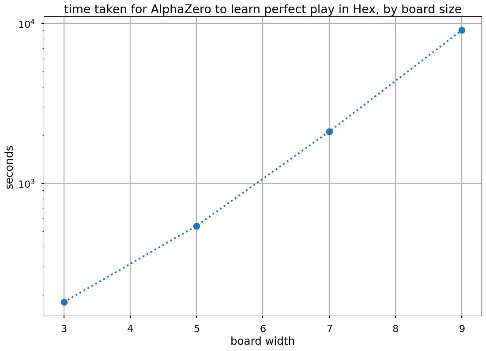

########
boardlaw
########

**boardlaw** is an ongoing research project into `scaling laws in multiagent systems <https://docs.google.com/document/d/1OwniAl1ocnqKHc4jtPVJzemm46q6ZgPVhXhmL2ZDIJw/edit>`_, 
as supported by `Survival and Flourishing <http://survivalandflourishing.org/>`_. 

AlphaZero Implementation
************************

Part of this project is a fast, low-resource AlphaZero implementation for small board games. Right now it can
solve 9x9 `Hex <http://www.mseymour.ca/hex_book/hexstrat0.html>`_ to perfect play in ~4 hours on a single RTX 2080 Ti.

'Perfect play' is judged by 'being on-par with `MoHex <https://github.com/cgao3/benzene-vanilla-cmake>`_', which claims 
perfect play on boards up to size 9x9.

Because of the low-resource constraint, this implementation does a few things unusually:

* The game - Hex - is vectorized and stepped :github:`entirely on the GPU <boardlaw/hex/cpp/kernels.cu>`. Playing 
  random actions, the throughput is ~100m boards/second on a 16k vectorization. This is high enough that it forms a 
  negligible part of the run time, even with very small networks.
* The MCTS is vectorized and carried out :github:`entirely on the GPU <boardlaw/mcts/cpp/kernels.cu>` too.
* It leverages :github:`Monte-Carlo Tree Search as Regularized Policy Optimization <https://arxiv.org/abs/2007.12509>` 
  to get away with doing ~64 sims compared to the usual ~800. It also subs out the bisection search recommended in the 
  paper for a Newton solver, which is much faster.
* It uses a minimal replay buffer of 64 steps, as repeated samples are bad for training speed 
  (`p55, 57 <https://arxiv.org/pdf/1912.06680.pdf>`_)
* It uses fully-connected resnets, as convnets seem to be overkill for boards this small.
* It uses `ReZero <https://arxiv.org/abs/2003.04887>`_ initialization to skip out on (slow, annoying) layernorms 
  and batchnorms.
* It uses a very small ``c_puct`` of 1/16. This turned out to be unexpectedly critical; I don't know whether it's a 
  consequence of the MCTS-as-regularized-tree-search, or if it reflects some other mistaken calculation elsewhere in my 
  implementation.

There are intentionally no game-specific features: this is all intended as a tool for exploring the power of generic 
machine learning systems.

A lot of this is un-ablated as of mid-Jan, so take it with a pinch of salt when deciding where to attribute performance to. 

.. _activelo:

ActiveElo
*********
One frustration in writing this was in figuring out what pairs of agents should play against eachother to most rapidly 
nail down the Elo of a new agent. I eventually cracked and wrote :github:`activelo <activelo>` which uses a variational Bayes 
approach to suggest, based on the games played so far, which pair should be played next. It's built using the superb 
`geotorch <https://github.com/Lezcano/geotorch>`_ constrained optimization toolkit.

Citations
*********
.. code:: bib

    @software{boardlaw,
        author = {{Andy L Jones}},
        title = {boardlaw},
        url = {https://www.github.com/andyljones/boardlaw},
        version = {0.0},
        date = {2021-01-20},
    }

Index
*****
.. toctree::
    :maxdepth: 2

    developers