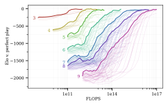
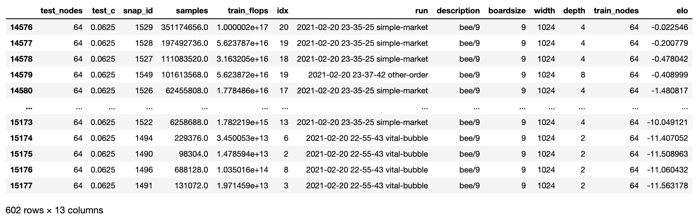

#####################################
Scaling Scaling Laws with Board Games
#####################################

Below you can find the code, models and data from our `Scaling Scaling Laws <https://arxiv.org/abs/2104.03113>`_ paper.

There's an `example notebook <https://colab.research.google.com/drive/1ItlSX1lEfj_6pSPXHMIrYWj9LBsCNCxl?usp=sharing>`_ 
demonstrating many of the things discussed below.

Code
****
Our code is `on Github <https://github.com/andyljones/boardlaw>`_. You can clone it and work directly from the repo,
or you can install it as a package with :: 

    pip install git+https://github.com/andyljones/boardlaw.git#egg=boardlaw

We recommend you do this in a `virtual environment <https://docs.python.org/3/tutorial/venv.html>`_. Or, better yet, a Docker container. You can find our Dockerfile `here <https://github.com/andyljones/boardlaw/tree/master/docker>`_. 

With the requirements installed and the database (see below) downloaded, you'll be able to reproduce all the plots from the paper using the `paper module <https://github.com/andyljones/boardlaw/blob/master/analysis/paper.py>`_. We recommend using the 
`paper-v2 <https://github.com/andyljones/boardlaw/releases/tag/paper-v2>`_ commit if this is your goal, as development has continued beyond the paper.

If you want to train your own models, take a look in the `main module <https://github.com/andyljones/boardlaw/blob/master/boardlaw/main.py#L132-L184>`_. 

If you want to evaluate your own models, take a look in the `arena package <https://github.com/andyljones/boardlaw/blob/master/boardlaw/arena/neural.py#L315-L322>`_.

Evaluation Data 
***************
Our evaluation data is held in a `SQLite database <https://f002.backblazeb2.com/file/boardlaw/output/experiments/eval/database.sql>`_. It'll be downloaded automatically
when you first query it::

    from boardlaw import sql, elos
    sql.agent_query()

You can find the schema for the database in `the sql module <https://github.com/andyljones/boardlaw/blob/master/boardlaw/sql.py#L24-L146>`_, along with 
documentation of the fields and some utility functions for querying it. 

Elos are not stored in the database directly, but can be calculated from the trials table. ::

    from boardlaw import sql, elos

    boardsize = 9
    ags = (sql.agent_query()
            .query('test_nodes == 64'))

    # There are a *lot* of trials, so for speed here we filter the table down
    trials = (sql.trial_query(boardsize, 'bee/%')
                .query('black_wins + white_wins >= 512')
                .groupby(['black_agent', 'white_agent'])
                .first().reset_index()
                .loc[lambda df: df.black_agent.isin(ags.index)]
                .loc[lambda df: df.white_agent.isin(ags.index)])
    ws, gs = elos.symmetrize(trials)

    ags_elos = elos.solve(ws, gs)
    ags = ags.join(ags_elos, how='inner')

which will give you a table that looks like this one

The Elos here are in base *e* because that's easier to deal with internally. 
Multiply by 400/ln(10) to get the Elos that you're used to.

Agent Data
**********
To download and play a specific agent::

    from boardlaw.arena import common
    from boardlaw import analysis, backup

    run, snapshot = '2021-02-20 21-11-32 intent-nets', 18

    backup.download_agent(run, snapshot)
    ag = common.agent(run, snapshot)
    worlds = common.worlds(run, n_envs=1)

    analysis.record(worlds, [ag, ag], n_trajs=1).notebook()

You can alternatively get a full trace of the game with ``analysis.rollout(world, agents, n_trajs=1)``.

Training Data
*************
To download the files for a specific training run, the best option is to use backblaze's sync tool. ::

    from boardlaw import backup
    import sys
    import time

    run = '2021-03-26 15-30-17 harsh-wait'
    dest = 'local_storage'

    bucket = 'boardlaw'
    api = backup.api(bucket)

    syncer = b2.Synchronizer(4)
    with b2.SyncReport(sys.stdout, False) as reporter:
        syncer.sync_folders(
            source_folder=b2.parse_sync_folder(f'b2://boardlaw/output/pavlov/{run}', api),
            dest_folder=b2.parse_sync_folder(f'{run}', api),
            now_millis=int(round(time.time() * 1000)),
            reporter=reporter)

When synced into the ``output/pavlov`` subdirectory, you can load the files using functions from `pavlov <https://github.com/andyljones/boardlaw/tree/master/pavlov>`_, a small 
monitoring library built alongside this project::  

    from pavlov import stats, storage, runs, files

    run = '2021-03-26 15-30-17 harsh-wait'

    # To list the runs you've downloaded 
    runs.pandas()

    # To list the files downloaded for a specific run
    files.pandas(run)

    # To view the residual variance from the run
    stats.pandas(run, 'corr.resid-var')

The state dicts from the snapshots themselves can also be accessed through pavlov using the ``pavlov.storage`` module.